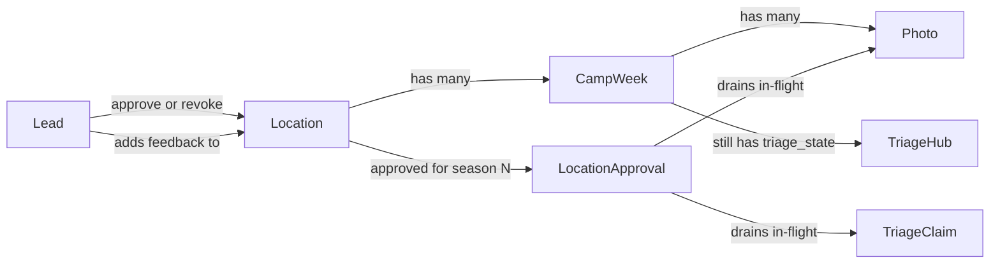
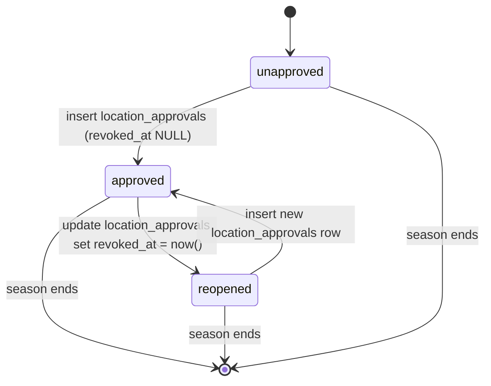

# Location-Approval Spec — Schema, Lifecycle, Triggers, Surfaces

> Per-location, per-season quality-review approval. Replaces the legacy `camp_weeks.signoff_at` flow as the unit of approval. Companion to [`PROJECT_CONTEXT.md`](./PROJECT_CONTEXT.md) and [`TRIAGE_SPEC.md`](./TRIAGE_SPEC.md). Implementation plan: [`../IMPLEMENTATION_PLAN.md`](../IMPLEMENTATION_PLAN.md).

---

## 0. Framing

In the legacy model, **camp_weeks** carried signoff: a lead reviewer signed off on each week individually and could flag the sibling 2nd week for recheck. In practice, leads work at the **location** level — they decide "Emory is good for the season" once Day-1 photos look right, and from then on the location is trusted unless something changes.

This spec captures that move: the **location** becomes the unit of approval; camp weeks remain photo containers and triage state holders. Approval drains in-flight triage work at that location; revoke reopens it. The Tuesday sample burst (TRIAGE_SPEC §5) retires because there is no longer a queue to "sample" — every photo at an unapproved location is in scope, and every photo at an approved location is not.

**Decisions locked in (from IMPLEMENTATION_PLAN.md):**

| # | Decision |
|---|---|
| 1 | **Season key** is `triage_config.season_first_week_start` (date). Seasons never overlap; one season at a time. |
| 2 | **Revoke creates a new `location_approvals` row** on re-approve rather than mutating history. Approval timeline is auditable. |
| 3 | **`camp_weeks.triage_state` keeps its existing pre-approval states** (`awaiting_photos` → `photos_in` → `triage_in_progress` → `triage_done`). The `senior_review` and `complete` states stop being assigned by triggers — approval lives on `locations` now. Enum values remain for historical rows. |
| 4 | **Rating workflow is untouched.** `rating_role` derivation stays week-based; `camp_weeks.rating_state` reopens on late photos exactly as today. Only the quality-review path changes. |
| 5 | **Backfill scope: current season only.** Only currently-signed-off locations get a `location_approvals` row inserted. |
| 6 | **Dual-write through phase 2-3.** The `/api/triage/signoff` shim writes BOTH a `location_approvals` row AND `camp_weeks.signoff_at` / `signoff_by`. The legacy senior-review screen keeps working; phase 4 removes the dual-write. |

---

## 1. Conceptual recap



Reviewer queue selection now filters out photos whose parent location is currently approved. Approval is per-season — a location approved for 2026 starts unapproved in 2027 unless re-approved.

---

## 2. State

### 2a. Location approval lifecycle

A `(location, season_start)` pair can have **zero or more** `location_approvals` rows. At any moment the location is in exactly one of three states:

- **`unapproved`** — no `location_approvals` row exists for this `(location_id, season_start)`, OR the most-recent row has `revoked_at IS NOT NULL`. Photos behave normally; reviewers can claim them.
- **`approved`** — the most-recent `location_approvals` row for this `(location_id, season_start)` has `revoked_at IS NULL`. Photos at this location are excluded from the reviewer queue; new photos arriving land at `triage_state = 'not_required'`.
- **`reopened`** — a synonym for unapproved when the previous state was approved (i.e. last row has `revoked_at` set). Renders distinctly in UI ("Revoked — awaiting re-review") but the trigger contract is identical to `unapproved`.

State is a derivation, not a column. The helper view `locations_with_approval` and the RPC `is_location_approved(uuid)` are the read paths.



Season transitions are implicit — when `triage_config.season_first_week_start` changes, queries naturally fall through to the new season's empty set.

### 2b. Camp-week state (unchanged except for terminal transitions)

`camp_weeks.triage_state` retains its pre-approval transitions:

```
not_required → awaiting_photos → photos_in → triage_in_progress → triage_done
```

The `senior_review` and `complete` enum values remain in the type, but **no trigger assigns them** after this refactor. Historical rows that already hold those values are left alone (the backfill migration does not retro-edit them). Late-photo reopen (`triage_done → triage_in_progress`) still works for unapproved locations; approved locations short-circuit at the photo-insert trigger so the camp week never leaves `triage_done`.

### 2c. Photo state (unchanged enum, modified transitions)

`photos.triage_state` is unchanged. New transitions:

- **Approve drain:** approved location's `pending` and `in_progress` photos → `not_required`. `triage_claim_id` is cleared on `in_progress` rows.
- **Approve insert:** new photo at approved location lands at `not_required` instead of `pending`.
- **Revoke reopen:** at the now-revoked location, photos in `not_required` whose parent week has `triage_role <> 'none'` flip back to `pending`. `clean`/`flagged`/`deleted` rows are untouched (their triage history stands).

---

## 3. Schema

### 3a. New tables

```sql
create table public.location_approvals (
  id              uuid primary key default gen_random_uuid(),
  location_id     uuid not null references public.locations(id) on delete cascade,
  season_start    date not null,
  approved_by     uuid not null references public.profiles(id) on delete restrict,
  approved_at     timestamptz not null default now(),
  revoked_by      uuid references public.profiles(id) on delete restrict,
  revoked_at      timestamptz,
  revocation_reason text,
  check ((revoked_at is null) = (revoked_by is null))
);

-- Partial unique index: only one active (unrevoked) approval per (location, season).
create unique index location_approvals_active_uq
  on public.location_approvals (location_id, season_start)
  where revoked_at is null;

create index location_approvals_location_season_idx
  on public.location_approvals (location_id, season_start, approved_at desc);
```

The partial unique index is the concurrency guard: two leads can't both create an active approval for the same `(location, season)`. The 409 surfaces to the client.

```sql
create table public.location_feedback_events (
  id            uuid primary key default gen_random_uuid(),
  location_id   uuid not null references public.locations(id) on delete cascade,
  author_id     uuid not null references public.profiles(id) on delete restrict,
  body          text not null check (length(body) > 0),
  camp_week_id  uuid references public.camp_weeks(id) on delete set null,
  created_at    timestamptz not null default now()
);

create index location_feedback_events_location_idx
  on public.location_feedback_events (location_id, created_at desc);

create table public.location_feedback_event_tags (
  event_id  uuid not null references public.location_feedback_events(id) on delete cascade,
  tag_id    text not null references public.tags(id) on delete restrict,
  primary key (event_id, tag_id)
);
```

### 3b. Modified existing enums

```sql
-- Add 'location_approved' as a release reason for claims drained by approval.
-- Per the senior_unflag pattern (migrations 38/39), the enum-value add lands
-- in its own migration so the value commits before any literal reference parses.
alter type public.claim_release_reason add value if not exists 'location_approved';
```

No other enum changes. `camp_week_triage_state` keeps `senior_review` and `complete` (Decision 3). `triage_event_kind` is untouched.

### 3c. New helper view

```sql
create or replace view public.locations_with_approval as
select
  l.*,
  la.id          as approval_id,
  la.approved_by,
  la.approved_at,
  la.revoked_at,
  la.revoked_by,
  case
    when la.id is null then 'unapproved'::text
    when la.revoked_at is null then 'approved'::text
    else 'reopened'::text
  end as approval_status
from public.locations l
left join lateral (
  select *
    from public.location_approvals
   where location_id = l.id
     and season_start = (select season_first_week_start from public.triage_config where id = 1)
   order by (revoked_at is null) desc, approved_at desc
   limit 1
) la on true;
```

The lateral subquery prefers an active (unrevoked) row if any exists for this `(location, season)`, regardless of timestamp — so simultaneous approve/revoke rows in the same transaction (e.g. tests) and clock-skew edge cases still resolve to the correct semantic state. Falling back to `approved_at desc` covers the all-revoked case, which renders as `reopened` to nudge a re-review. The view distinguishes `unapproved` (no row this season) from `reopened` (row exists, last one revoked).

### 3d. New RPC

```sql
create or replace function public.is_location_approved(p_location_id uuid)
returns boolean
language sql
stable
security definer
set search_path = public
as $$
  select exists (
    select 1
      from public.location_approvals
     where location_id = p_location_id
       and season_start = (select season_first_week_start from public.triage_config where id = 1)
       and revoked_at is null
  );
$$;
```

Used by triggers to short-circuit photo state transitions. `SECURITY DEFINER` so trigger functions invoked under service role or definer context still resolve correctly.

### 3e. RLS

| Table | select | insert | update | delete |
|---|---|---|---|---|
| `location_approvals` | authenticated | RPC only (`approve_location` SECURITY DEFINER) | RPC only (`revoke_location`) | admin only |
| `location_feedback_events` | authenticated | `author_id = auth.uid() AND is_senior_or_admin()` | author or admin | admin only |
| `location_feedback_event_tags` | authenticated | event owner or `is_senior_or_admin()` (tied to owning event) | — | cascade with event |

Direct client writes to `location_approvals` are denied. The approve/revoke RPCs perform the inserts/updates so the drain and reopen triggers fire under a consistent identity.

---

## 4. Triggers

All trigger functions are `SECURITY DEFINER SET search_path = public`. Naming follows TRIAGE_SPEC §4 conventions.

### 4a. Approve drain

**`tg_location_approvals_after_insert_drain`** — `after insert` on `location_approvals` when `revoked_at IS NULL`:

```sql
-- 1. Stamp any active claims at this location as released.
update public.triage_claims c
   set released_at = now(),
       release_reason = 'location_approved'
  from public.camp_weeks cw
 where c.camp_week_id = cw.id
   and cw.location_id = new.location_id
   and c.released_at is null;

-- 2. Drain pending + in_progress photos at this location to not_required.
--    Clear triage_claim_id so released claims don't leave dangling refs.
update public.photos p
   set triage_state = 'not_required',
       triage_claim_id = null
  from public.camp_weeks cw
 where p.camp_week_id = cw.id
   and cw.location_id = new.location_id
   and p.triage_state in ('pending', 'in_progress');

-- 3. Recompute camp_week.triage_state for every affected week at this location.
--    Approved-location weeks settle at either 'not_required' (no photos triaged
--    yet) or 'triage_done' (some photos already in terminal state pre-approve).
--    Handled by reusing the existing photos-after-update recompute path:
--    we already ran step 2's UPDATE which fires
--    tg_photos_after_update_state_recompute_week_state per photo. No
--    additional fanout needed here.
```

The photo-update fanout from step 2 produces the correct camp_week state automatically — same recompute logic the existing trigger uses.

### 4b. Revoke reopen

**`tg_location_approvals_after_update_revoke`** — `after update` on `location_approvals` when `revoked_at` transitions NULL → set:

```sql
-- 1. Flip photos at this location from not_required → pending, but only:
--    - photos whose parent week has triage_role <> 'none' (still triage-eligible)
--    - photos not already in a terminal state (clean/flagged/deleted are
--      historical and stay as-is)
--    Photos marked 'not_required' specifically by the previous drain are the
--    target set; the role-gate prevents reopening weeks 3+ photos.
update public.photos p
   set triage_state = 'pending'
  from public.camp_weeks cw
 where p.camp_week_id = cw.id
   and cw.location_id = new.location_id
   and p.triage_state = 'not_required'
   and cw.triage_role <> 'none';

-- 2. The per-photo state UPDATE in step 1 fires the existing recompute
--    trigger, which moves affected weeks from not_required/awaiting_photos
--    to photos_in (or triage_in_progress if claims are somehow still active —
--    they aren't, but the recompute is defensive).
```

Claims released with `release_reason = 'location_approved'` are **not** re-opened on revoke — reviewers don't time-travel back into a batch they were drained out of.

### 4c. Modified existing triggers

**`tg_photos_after_insert_recompute_week_state`** — add a guard at the top:

```sql
if public.is_location_approved((select location_id from public.camp_weeks where id = new.camp_week_id)) then
  -- Approved location: photo stays not_required, week state unchanged.
  update public.photos set triage_state = 'not_required' where id = new.id;
  return null;
end if;
-- ... existing logic continues ...
```

**`tg_triage_claims_after_update_released_revert_photos`** — modify the photo-revert branch so that when the claim's release reason is `'location_approved'`, photos go to `not_required` instead of `pending`. (In practice the approve drain has already done this, but defending the order-of-operations matters for the explicit-release path.)

### 4d. Removed triggers

The following triggers no longer fire (drop in the same migration as the new logic):

- `tg_camp_weeks_after_update_first_senior_touch` — no longer needed; no `senior_review` state assignment.
- `tg_camp_weeks_after_update_signoff` — no longer needed; signoff is no longer the unit of approval. The associated recheck side-effect (flipping a sibling week to `second_week_recheck`) is dropped along with it. Approval has no sibling-week side effects.

The `triage_signoff_camp_week` RPC is retained but rewritten in phase 2 to insert into `location_approvals` (dual-write per Decision 6). Phase 4 removes it.

---

## 5. API routes

### 5a. New routes

| Route | Method | Auth | Notes |
|---|---|---|---|
| `/api/locations/[id]/approve` | POST | senior or admin | Body `{ season_start? }` (defaults to current). Inserts `location_approvals` via RPC. Returns the new approval row. **409** on concurrent approve (partial unique index). |
| `/api/locations/[id]/revoke` | POST | senior or admin | Body `{ reason? }`. Updates the active `location_approvals` row's `revoked_at` / `revoked_by` / `revocation_reason`. **404** if no active approval. |
| `/api/locations/[id]/feedback` | POST | senior or admin | Body `{ body, camp_week_id?, tag_ids? }`. Inserts a feedback event and any tag junction rows. |
| `/api/locations/[id]/feedback` | GET | authenticated | Returns recent feedback events for the location, newest first, joined with tag labels. |

### 5b. Modified routes

**`/api/triage/signoff`** (shim during phases 2-3, removed in phase 4):

- Continues to accept its existing body (`{ camp_week_id, flag_second_week_recheck }`).
- Resolves the camp_week → location, then **dual-writes**:
  - Inserts a `location_approvals` row for `(location_id, current season)`.
  - Updates `camp_weeks.signoff_at` / `signoff_by` (legacy column writes preserved for rollback safety).
- `flag_second_week_recheck` is **silently ignored**; the new model has no sibling-week side effects. Log a deprecation warning when the flag is true so we know if any caller still sets it.
- Returns the same `{ ok: true }` shape so existing clients keep working.

**`/api/triage/events`** — adds a grace window for the approve-drain race:

```ts
// Inside the events POST handler, before inserting the event:
// Look up the photo's location and check if it was approved within the last 60s.
// If so, the reviewer just finished their batch as the drain landed — accept
// the event normally. Beyond 60s, return 410 Gone with an explanation.
const recentApproval = await supabase
  .from("location_approvals")
  .select("approved_at")
  .eq("location_id", locationIdForPhoto)
  .gte("approved_at", new Date(Date.now() - 60_000).toISOString())
  .order("approved_at", { ascending: false })
  .limit(1)
  .maybeSingle();

if (isLocationApproved(locationIdForPhoto)) {
  if (!recentApproval) {
    return NextResponse.json(
      { error: "location_approved", message: "This location was approved; new events are no longer accepted." },
      { status: 410 },
    );
  }
  // Within grace window — accept normally, mark response.
  // Response will include: { eventId, location_approved_during_batch: true }
}
```

The 60-second window is server-side derived from `now() - approved_at`, never trusted from a client timestamp.

**`/api/triage/sample-burst`** — kept available through phase 2-3 for rollback; phase 4 removes the route entirely and the corresponding `vercel.json` cron entry.

### 5c. Reviewer queue ordering

Whichever lib selects the next claimable photos (currently the claims POST handler) must add a `NOT EXISTS` against the active approvals partial index:

```sql
where photos.triage_state = 'pending'
  and not exists (
    select 1
      from public.location_approvals la
     where la.location_id = (select location_id from camp_weeks where id = photos.camp_week_id)
       and la.season_start = (select season_first_week_start from triage_config where id = 1)
       and la.revoked_at is null
  )
order by photos.captured_at desc, photos.id desc;
```

The `sampled_for_burst desc` clause is removed from the order. The column stays through phase 4, then drops.

---

## 6. UI

### 6a. Lead hub (`location-list`)

Replaces the current senior-review screen as the top-level lead destination. Lists locations in the current season:

- Name, region/division
- Approval status badge: `Approved <relative date>` / `Awaiting review` / `Revoked — awaiting re-review`
- First-week start date (windowed approval signal)
- Pending photo count
- Last feedback timestamp + author

Filter chips: All / Awaiting / Approved / Revoked. Click → location detail.

### 6b. Location detail (`location-detail`)

- Header: location name, approval status, Approve / Revoke action.
- **Approve modal**: confirms pending-photo count and drain warning ("This will end 2 reviewers' in-flight batches at this location").
- **Revoke modal**: requires a free-text reason; surfaces affected-photo count.
- **Feedback feed**: `location_feedback_events` newest-first; Add feedback composer (textarea + optional tag picker + optional camp-week context).
- **Camp weeks** section: weeks at this location with photo counts and per-week `triage_state`. Click → existing `SeniorWeekDashboard` as a drill-down.

### 6c. Reviewer queue

- Group claim-batch options by location (collapsible).
- "Newest first" ordering label, since it's different from the old burst-sampled order.
- Empty state when every location is approved: "All caught up for the season."

### 6d. Drain toast

Reviewer's claim-batch screen subscribes to its own claim row via Supabase realtime. On `released_at` change with `release_reason = 'location_approved'`:

- Toast: "Location X was approved by <lead> — nice work on the last batch. Returning you to the queue."
- Disable submit on photos beyond the current one (grace-window accepts the in-flight one).
- Navigate to the queue on toast dismiss or 5s timeout.

---

## 7. Migration ordering

Per the IMPLEMENTATION_PLAN.md phases, split as follows:

| # | File | Phase | Contents |
|---|---|---|---|
| 41 | `20260527000041_location_approval_schema.sql` | 1 | Tables, view, RPC, RLS, backfill `INSERT … SELECT` from currently-signed-off camp_weeks. No trigger changes. |
| 42 | `20260528000042_location_approval_enum.sql` | 2 | `alter type claim_release_reason add value 'location_approved'`. Standalone so the value commits before the logic migration's literal references parse. |
| 43 | `20260528000043_location_approval_logic.sql` | 2 | Drop legacy triggers (§4d), modify existing triggers (§4c), create new triggers (§4a-b). Idempotent (`create or replace`, `drop policy if exists`). |

Phases 1 and 2 land as separate PRs so the schema can soak for 24-48h with zero behavioral change before the logic swap.

---

## 8. Backfill

In migration 41:

```sql
insert into public.location_approvals (location_id, season_start, approved_by, approved_at)
select distinct on (cw.location_id)
  cw.location_id,
  (select season_first_week_start from public.triage_config where id = 1),
  cw.signoff_by,
  cw.signoff_at
from public.camp_weeks cw
where cw.triage_state = 'complete'
  and cw.signoff_at is not null
  and cw.signoff_by is not null
  and cw.starts_on >= (select season_first_week_start from public.triage_config where id = 1)
order by cw.location_id, cw.signoff_at desc;
```

Includes a `RAISE NOTICE 'backfilled % approvals', <count>` for visibility in the migration log. Verify before phase 2 by selecting `locations_with_approval where approval_status = 'approved'` and spot-checking against the spreadsheet of locations Jimmy has signed off this season.

---

## 9. Testing strategy

Substitutes for live user feedback during phases 0-2.

### 9a. DB-layer (`supabase/tests/e2e_location_approval.sql`)

Trigger contract tests. Mirror the structure of `e2e_triage_triggers.sql`. Scenarios:

1. **Approve drain** — seed a location with photos in `pending`, `in_progress`, `clean`, `flagged` states, and one active claim. Insert `location_approvals` row. Assert: pending/in_progress → `not_required`, clean/flagged untouched, claim released with `release_reason = 'location_approved'`, week state recomputed.
2. **Approve new-photo short-circuit** — approve a location, then insert a new photo. Assert: photo lands at `not_required`, week state unchanged.
3. **Revoke reopen** — approve, then revoke. Assert: photos that were drained to `not_required` flip back to `pending`; clean/flagged stay; claims released by approval stay released.
4. **Revoke + late photo** — revoke, then insert a new photo. Assert: photo lands at `pending` (normal pre-approval path).
5. **Concurrent approve** — insert two active approval rows for the same `(location, season)`. Assert: second insert raises unique-violation.
6. **Re-approve after revoke** — approve, revoke, approve again. Assert: two rows exist, only the second is active, drain re-fires.

### 9b. Vitest API tests

- **`tests/api/locations-approve.test.ts`** — happy path, double-approve 409, drain assertion via service-role select after the route call.
- **`tests/api/locations-revoke.test.ts`** — revoke flips photos back, RLS denies reviewer, reason persisted.
- **`tests/api/locations-feedback.test.ts`** — insert + list, tag junction, RLS denies reviewer insert.
- **`tests/api/signoff.test.ts`** (update) — assert the shim inserts a `location_approvals` row AND keeps writing `camp_weeks.signoff_at` for backward compat. Assert deprecation warning is logged when `flag_second_week_recheck = true`.
- **`tests/api/events.test.ts`** (extend) — grace-window cases using `vi.useFakeTimers()`:
  - Approve, immediately submit event → 200 with `location_approved_during_batch: true`.
  - Approve, advance 90s, submit event → 410 Gone.

### 9c. Simulation seed

`scripts/seed-simulation.ts` (new). Builds a production-shaped local snapshot:

- 5 locations across 2 divisions.
- One location already approved (mirrors Emory).
- Two locations with Day-1 photos pending, no claims yet.
- One location mid-triage with two reviewers holding active claims (drain demo target).
- One location revoked-and-reopened with a fresh batch of pending photos.

Walk through Friday afternoon as a "Jimmy in a box" exercise — every screen and action in the spec should be reachable without external state.

### 9d. Manual smoke (browser, phase 3 only)

Pure simulation can't cover:

- Realtime drain toast (two browser windows: lead approves, reviewer's open claim toasts).
- 409 handling on concurrent approve (two browser tabs).
- Visual hierarchy of the location list at realistic data volumes.

---

## 10. Open questions (not blockers)

- Should approved-location feedback events render on the camp-week drill-down too, or only at the location level?
- After phase 4 drops `camp_weeks.signoff_at`, do we keep `recheck_flagged_at` / `recheck_flagged_by` as historical artifacts or null them out? Currently leaning toward keep — costs nothing.
- Per-week feedback rollup view in the location detail (vs. flat list). Defer to phase 5 once we see how leads actually use the feed.
