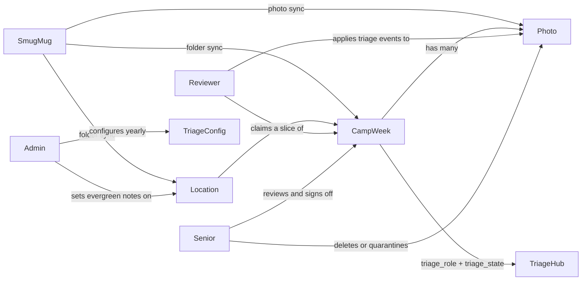
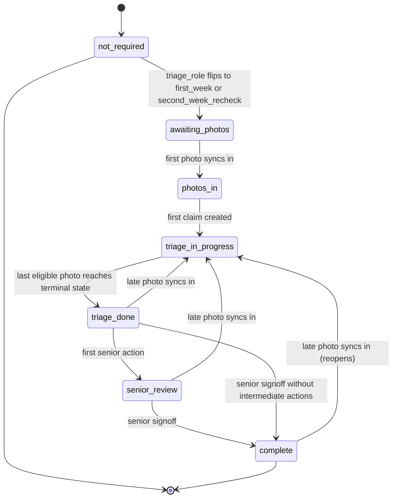

# Triage Spec — Schema, State Machines, Triggers, Surfaces

## 0. Framing

This document is the full design for the triage-first refactor. It is the contract Step 3 implementation will follow.

**Adopted decisions** (from `spec/REFACTOR_INVENTORY.md` §6, signed off without override — listed here for visibility):

| § | Decision adopted | Reasoning |
|---|---|---|
| 6.1 | Drop `queue_order` enum + `smugmug_config.queue_order` column. Hardcode triage photo order. | Triage iterates photos in upload order (oldest-first within a claim, see §5); no admin knob needed yet. |
| 6.2 | Drop `tags.kind` column + `tag_kind` enum. Single bucket. | Ops-rubric flags share one shape; **`tags.category`** drives senior-dashboard rollup buckets — confirmed mapping and column rules in §10 (migration **27**). |
| 6.3 | Preserve the `Image.Hidden`-driven quarantine contract: `photos.is_quarantined` stays on `photos`; `lib/quarantine-trigger.ts` + `/api/smugmug/quarantine` reused unchanged. | One less rewrite. Trigger pattern is content-neutral. |
| 6.4 | **Unified state machine on `camp_weeks`** with `triage_role` discriminator. | Avoids duplicate triggers, duplicate `union all` queries, duplicate dashboard UI. See §2. |
| 6.5 | **`triage_state` column on `photos`**, not a join table. | One triage cycle per photo (brief excludes recurrence). Column avoids indirection on every grid render. |
| 6.6 | Add nullable tri-state `camp_weeks.is_first_week_override` for manual edge-case correction. | Cheap safety valve; admin UI lives on the Admin → Locations notes screen (per-week toggle). |
| 6.7 | Score-by-count, no leaderboard. | Per brief. |
| 6.8 | Leave placeholder migrations 10/11/12 in place; reserve numbers as dead. | Per inventory §1c. |

**Stakeholder resolutions — Step 2 open questions closed:**

| ID | Resolution |
|---|---|
| **Q1** | **Keep `senior_review` state** between `triage_done` and `complete`. |
| **Q2** | **Sibling 2nd week:** smallest `starts_on` **strictly greater** than the 1st week's `starts_on`, tie-break **`id` ascending**. |
| **Q3** | **`SECURITY DEFINER` RPC** for constrained `camp_weeks` signoff / positive-assessment writes (not verbose per-column RLS `with check`). |
| **Q4** | **Provide** Admin → Triage settings **“Reset all sample flags”** (`sampled_for_burst = false` for eligible pending/in-progress rows per §5). |
| **Q5** | **Cap: 3 active claims** per reviewer. |
| **Q6** | **Replace default tag seed** with **exactly 12 tags** whose **labels match the 2026 Camp Photo Review spreadsheet column headers verbatim** (see §3f). Slugs are implementation-chosen; suggested slugs listed there. Positive spreadsheet assessments (**Great Quality**, **Great Variety**, **Shininess Looks Great**) stay **camp_week–level senior fields**, not tags. **`tags.category`** for senior rollup (**four rubric buckets + escape hatch**) — confirmed in §10; lands with migration **27**. |
| **Q7** | **Vercel cron** for sample-burst: **`0 19 * * 2`** (Tuesday **19:00 UTC** — after ~10am US-local director deadlines). Seed **`triage_config.sample_burst_hour = 19`** and **`sample_burst_dow = 2`** so defaults align with cron. Handler **must read `triage_config`** and **no-op** when the invocation is **before** the configured burst **day/hour** (scheduled/cron path only); **manual admin “Run sample burst now”** bypasses that gate. See §5. |
| **Q8** | **“Whole week” claim** = UI preset only: `slice_size = pending count`; **no** distinct boolean on `triage_claims`. |

**Hard requirement — SmugMug orphan preservation (same delivery sequence as triage tables):**

After `triage_events` / `triage_event_tags` and `photos.triage_state` exist, **`lib/smugmug/sync/photos.ts` MUST NOT delete** “orphan” rows (photos missing from the latest SmugMug walk) when **either**:

- `EXISTS (SELECT 1 FROM triage_events e WHERE e.photo_id = photos.id)`, **or**
- `photos.triage_state IS DISTINCT FROM 'not_required'`.

This restores the intent of the old `reviews`-based preservation guard **contemporaneously** with the data it protects — **not** as later polish. Lands in the **same Step 3 chunk** as migrations introducing those columns/tables (see §8).

---

## 1. Conceptual recap

The primary object is `camp_weeks`. Photos are always accessed through a camp_week. Every reviewer-facing and senior-facing screen is camp-week-scoped. Each location has up to 12 weeks per summer; only **one** week per location is triaged automatically (the 1st week), and **one** other may be triaged conditionally (the 2nd week, when a senior flags it for recheck). Weeks 3+ never enter triage.



---

## 2. State machines

### 2a. Unified camp-week state machine

Seven states on `camp_weeks.triage_state`:

- **`not_required`** — default. Weeks 3+ at every location, and 2nd weeks that haven't been flagged for recheck. No surface in the triage hub.
- **`awaiting_photos`** — 1st week or recheck-flagged 2nd week with no photos yet synced.
- **`photos_in`** — same as above, with at least one photo present; no reviewer has claimed yet.
- **`triage_in_progress`** — at least one active claim OR at least one photo in `pending`/`in_progress`.
- **`triage_done`** — every photo in this week is in a terminal state (`clean`/`flagged`/`deleted`). Awaiting senior.
- **`senior_review`** — senior has taken at least one action (per-photo action, positive assessment toggle) but has not yet signed off. Distinct from `triage_done` so the dashboard widget can split "X awaiting senior · Y already under senior review."
- **`complete`** — senior signoff recorded. Terminal.

`camp_weeks.triage_role` is one of:

- **`none`** — week is not eligible for triage. Default.
- **`first_week`** — derived: earliest week at this location whose `starts_on` falls in the configured 1st-week window, OR explicitly forced via `is_first_week_override = true`.
- **`second_week_recheck`** — set by a side-effect trigger when a senior signs off on a sibling 1st week with the recheck flag.



**Who triggers each transition:**

| From | To | Trigger | Actor |
|---|---|---|---|
| `not_required` | `awaiting_photos` | `tg_camp_weeks_compute_triage_role` (+ fanout where applicable) | service role (sync) / admin (override) / signoff side effect |
| `awaiting_photos` | `photos_in` | `tg_photos_after_insert_recompute_week_state` | service role (photo sync) |
| `photos_in` | `triage_in_progress` | `tg_triage_claims_after_insert_advance_week_state` | reviewer (claim API) |
| `triage_in_progress` | `triage_done` | `tg_photos_after_update_recompute_week_state` | reviewer (triage event API) |
| `triage_done` | `senior_review` | `tg_camp_weeks_first_senior_touch` (fires on first per-photo senior action OR positive assessment toggle) | senior |
| `senior_review`/`triage_done` | `complete` | `tg_camp_weeks_after_signoff` | senior (signoff API) |
| `triage_done`/`senior_review`/`complete` | `triage_in_progress` | `tg_photos_after_insert_recompute_week_state` (late upload reopens) | service role (photo sync) |

### 2b. Photo state machine

Six states on `photos.triage_state`:

- **`not_required`** — default for photos whose parent week has `triage_role = 'none'`.
- **`pending`** — eligible for triage, not held by any active claim.
- **`in_progress`** — held by an active claim (stamped via `photos.triage_claim_id`).
- **`clean`** — triaged, no flags.
- **`flagged`** — triaged, at least one flag tag attached.
- **`deleted`** — senior deleted (DB row stays, SmugMug row stays, future sync respects).

`photos.is_quarantined` is **orthogonal** to `triage_state` (per §6.3).

```mermaid
stateDiagram-v2
  [*] --> not_required: photo synced into week with triage_role=none
  [*] --> pending: photo synced into week with triage_role!=none
  not_required --> pending: week's triage_role flips to first_week or second_week_recheck
  pending --> in_progress: claim created (photos stamped at claim time)
  in_progress --> clean: reviewer triage_event kind=clean
  in_progress --> flagged: reviewer triage_event kind=flag
  in_progress --> pending: claim released (explicit or auto-expired)
  clean --> deleted: senior triage_event kind=senior_delete
  flagged --> deleted: senior triage_event kind=senior_delete
  pending --> not_required: triage_role flips back to none (rare; only on admin override)
```



**Who triggers:** every photo state mutation is performed by `SECURITY DEFINER` triggers on `triage_events` / `triage_claims` / `camp_weeks` — never by direct client UPDATE on `photos`. `photos` retains service-role-only UPDATE RLS.

---

## 3. Schema

### 3a. New enums

```sql
create type camp_week_triage_role  as enum ('none', 'first_week', 'second_week_recheck');
create type camp_week_triage_state as enum (
  'not_required', 'awaiting_photos', 'photos_in',
  'triage_in_progress', 'triage_done', 'senior_review', 'complete'
);
create type photo_triage_state     as enum (
  'not_required', 'pending', 'in_progress', 'clean', 'flagged', 'deleted'
);
create type triage_event_kind      as enum (
  'clean', 'flag',
  'senior_delete', 'senior_quarantine', 'senior_release_quarantine'
);
create type claim_release_reason   as enum ('explicit', 'auto_expired', 'week_complete', 'admin_force');
create type tag_category           as enum ('quality', 'setup', 'brand', 'safety', 'general');
```

### 3b. Modified existing tables

**`camp_weeks`** — new columns:

| Column | Type | Default | Notes |
|---|---|---|---|
| `triage_role` | `camp_week_triage_role` | `'none'` not null | Maintained by `tg_camp_weeks_compute_triage_role`. |
| `triage_state` | `camp_week_triage_state` | `'not_required'` not null | Maintained by triggers; no direct client write except admin override. |
| `is_first_week_override` | `boolean` | nullable (tri-state) | NULL = auto-derive from window; TRUE = force `first_week`; FALSE = force `none`. Admin-only write. |
| `triage_started_at` | `timestamptz` | nullable | Set when state first leaves `awaiting_photos`. |
| `triage_done_at` | `timestamptz` | nullable | Set when state first enters `triage_done`. |
| `senior_review_started_at` | `timestamptz` | nullable | Set when state first enters `senior_review`. |
| `signoff_at` | `timestamptz` | nullable | Set when senior signs off. |
| `signoff_by` | `uuid` → `profiles(id)` on delete set null | nullable | The senior. |
| `recheck_flagged_at` | `timestamptz` | nullable | Set on the **1st** week when signoff says "flag 2nd week." Not set on the 2nd week itself. |
| `recheck_flagged_by` | `uuid` → `profiles(id)` on delete set null | nullable | |
| `positive_great_quality` | `boolean` | `false` not null | Senior-only write. |
| `positive_great_variety` | `boolean` | `false` not null | Senior-only write. |
| `positive_shininess_great` | `boolean` | `false` not null | Senior-only write. |

**`locations`** — new column:

| Column | Type | Default | Notes |
|---|---|---|---|
| `evergreen_notes` | `text` | nullable | Admin-editable; reviewer-visible on the triage grid sidebar when working any week at this location. |

**`photos`** — new columns (post-demolition drops of `current_status` + `priority`):

| Column | Type | Default | Notes |
|---|---|---|---|
| `triage_state` | `photo_triage_state` | `'not_required'` not null | Maintained by triggers. |
| `triage_claim_id` | `uuid` → `triage_claims(id)` on delete set null | nullable | Stamped at claim creation; cleared when claim releases. |
| `sampled_for_burst` | `boolean` | `false` not null | Set true by the Tuesday-burst sampler; never auto-cleared. See §5. |

**`tags`** — no `kind` column (already dropped in demolition).

| Column | Type | Default | Notes |
|---|---|---|---|
| `category` | `tag_category` | — | Per §10: **`NULL`** allowed **or** **`NOT NULL DEFAULT 'general'`**; never **`NOT NULL`** without default. Senior rollup + **`general`** for uncategorized future tags. |

See §10 for semantics and §3f seed values.

**`app_settings`** — demolition already dropped reviewer-copy columns. No new columns here; yearly triage knobs live in `triage_config`.

**`smugmug_config`** — `mode` + `smugmug_mode` enum kept as placeholder per inventory.

### 3c. New tables

**`triage_config`** — singleton, yearly setup (admin-edited each spring).

```sql
create table public.triage_config (
  id                         smallint primary key default 1 check (id = 1),
  first_week_window_start    date    not null,
  first_week_window_end      date    not null,
  max_for_triage_per_burst   int     not null default 200 check (max_for_triage_per_burst > 0),
  sample_burst_dow           smallint not null default 2 check (sample_burst_dow between 0 and 6),  -- 0=Sun, 2=Tue
  sample_burst_hour          smallint not null default 19 check (sample_burst_hour between 0 and 23),  -- UTC; aligns with vercel.json
  claim_expiry_minutes       int     not null default 60 check (claim_expiry_minutes > 0),
  updated_at                 timestamptz not null default now(),
  check (first_week_window_end >= first_week_window_start)
);

insert into public.triage_config
  (id, first_week_window_start, first_week_window_end, sample_burst_dow, sample_burst_hour)
values
  (1, date '2026-05-24', date '2026-08-09', 2, 19);
```

**`triage_claims`** — active and historical reviewer claims on a camp_week.

```sql
create table public.triage_claims (
  id                  uuid primary key default gen_random_uuid(),
  camp_week_id        uuid not null references public.camp_weeks(id) on delete cascade,
  reviewer_id         uuid not null references public.profiles(id)   on delete cascade,
  slice_size          int  not null check (slice_size > 0),
  claimed_at          timestamptz not null default now(),
  last_activity_at    timestamptz not null default now(),
  released_at         timestamptz,
  release_reason      claim_release_reason,
  check ((released_at is null) = (release_reason is null))
);
create index triage_claims_active_per_week_idx
  on public.triage_claims (camp_week_id) where released_at is null;
create index triage_claims_active_per_reviewer_idx
  on public.triage_claims (reviewer_id) where released_at is null;
create index triage_claims_sweeper_idx
  on public.triage_claims (last_activity_at) where released_at is null;
```

**`triage_events`** — append-only audit log.

```sql
create table public.triage_events (
  id           uuid primary key default gen_random_uuid(),
  photo_id     uuid not null references public.photos(id)   on delete cascade,
  reviewer_id  uuid not null references public.profiles(id) on delete restrict,
  claim_id     uuid          references public.triage_claims(id) on delete set null,
  kind         triage_event_kind not null,
  quarantine_intent boolean not null default false,
  note         text,
  created_at   timestamptz not null default now(),
  check (
    case kind
      when 'flag' then true
      when 'clean' then quarantine_intent = false
      else quarantine_intent = false
    end
  )
);
create index triage_events_per_reviewer_idx on public.triage_events (reviewer_id, created_at desc);
create index triage_events_per_photo_idx    on public.triage_events (photo_id, created_at desc);
```

**`triage_event_tags`** — junction for flag-kind events.

```sql
create table public.triage_event_tags (
  event_id uuid not null references public.triage_events(id) on delete cascade,
  tag_id   text not null references public.tags(id) on delete restrict,
  primary key (event_id, tag_id)
);
```

### 3d. Indexes recap (new only)

| Table | Index | Purpose |
|---|---|---|
| `camp_weeks` | `camp_weeks_triage_hub_idx (triage_state, triage_role) where triage_state <> 'not_required' and triage_state <> 'complete'` | Triage hub list. |
| `camp_weeks` | `camp_weeks_awaiting_signoff_idx (signoff_at) where triage_state in ('triage_done', 'senior_review')` | “Awaiting signoff” widget. |
| `photos` | `photos_triage_grid_idx (camp_week_id, triage_state)` | Senior dashboard + reviewer grid. |
| `photos` | `photos_triage_pending_pool_idx (camp_week_id, sampled_for_burst desc, captured_at) where triage_state = 'pending'` | Claim creation ordering. |
| `photos` | `photos_triage_claim_idx (triage_claim_id) where triage_claim_id is not null` | Claim release sweeper. |
| `photos` | `photos_is_quarantined_idx (is_quarantined) where is_quarantined = true` | Optional senior quarantine list. |

### 3e. RLS policies

Default deny on every new table. Helpers `public.is_admin()` / `public.is_senior_or_admin()` reused.

**`triage_config`** — `select`: authenticated; writes: `is_admin()`.

**`triage_claims`** — `select`: authenticated; `insert`: `reviewer_id = auth.uid()`; `update`: owner or admin (force-release); `delete`: admin only; sweeper uses service role.

**`triage_events`** — `select`: authenticated; `insert`: reviewer kinds with `reviewer_id = auth.uid()`, senior kinds with `is_senior_or_admin()`; no update/delete.

**`triage_event_tags`** — `select`: authenticated; `insert`: tied to owning event; no update/delete.

**`camp_weeks`** — Signoff / positives via **`SECURITY DEFINER` RPC** (Q3); triggers bypass RLS. Admin-only column overrides as policies or RPC-only — implementation chooses one consistent pattern.

**`locations`** — `update evergreen_notes`: admin with column-scoped check or RPC.

**`photos`** — service-role writes only; triggers apply mutations.

**`tags`** — admin write pattern unchanged.

### 3f. Tag seed — hard requirement (migration 27)

Insert **exactly 12** rows into `public.tags`. **`label` must match verbatim** (spreadsheet column headers). **`category`** per §10 (rubric-aligned seed). **`id`** (slug) may be these suggestions:

| display_order | id (slug) | label (verbatim) | category |
|---:|---|---|---|
| 1 | `blurry-photos` | Blurry Photos | quality |
| 2 | `duplicate-photos` | Duplicate Photos | quality |
| 3 | `low-lighting` | Low Lighting | quality |
| 4 | `lacking-variety` | Lacking Variety | quality |
| 5 | `water-bottles-by-laptops` | Water Bottles by Laptops | setup |
| 6 | `students-without-lanyards` | Students w/o Lanyards | safety |
| 7 | `decals-falling-off` | Decals Falling Off | brand |
| 8 | `decals-bubbling` | Decals Bubbling | brand |
| 9 | `decals-cluttered` | Decals Cluttered | brand |
| 10 | `bb-arena-missing-decals` | BB Arena Missing Decals | brand |
| 11 | `visible-boxes` | Visible Boxes | setup |
| 12 | `messy-lab` | Messy Lab | setup |

First four = spreadsheet **Photo Quality** group; last eight = **Lab Shininess** group. **`active = true`** for all.

---

## 4. Triggers

All trigger functions are `SECURITY DEFINER SET search_path = public` (same rationale as legacy review triggers — see `spec/PROJECT_CONTEXT.md` “RLS gotcha”). Naming: `tg_<table>_<phase>_<purpose>`.

### 4a. `camp_weeks` role derivation

**`tg_camp_weeks_compute_triage_role`** — `before insert or update of starts_on, is_first_week_override` on `camp_weeks`.

Logic:

```
if NEW.is_first_week_override = TRUE  -> role := 'first_week'
elif NEW.is_first_week_override = FALSE -> role := 'none'
else
  let cfg     = (select * from triage_config where id = 1);
  let in_window = NEW.starts_on between cfg.first_week_window_start and cfg.first_week_window_end;
  let is_earliest_in_window = NOT EXISTS (
    select 1 from camp_weeks cw
    where cw.location_id = NEW.location_id
      and cw.id <> NEW.id
      and cw.starts_on between cfg.first_week_window_start and cfg.first_week_window_end
      and (cw.starts_on < NEW.starts_on
           or (cw.starts_on = NEW.starts_on and cw.id < NEW.id))
  );
  role := case when in_window and is_earliest_in_window then 'first_week' else 'none' end;

-- Preserve existing 'second_week_recheck': only set explicitly by signoff side-effect trigger.
if TG_OP = 'UPDATE' and OLD.triage_role = 'second_week_recheck' then role := 'second_week_recheck';

NEW.triage_role := role;
```

**`tg_triage_config_after_update_recompute_all_roles`** — `after update of first_week_window_start, first_week_window_end` on `triage_config`. Re-derive every camp_week’s role (costly but rare).

### 4b. `camp_weeks` role-change fanout to photos

**`tg_camp_weeks_after_update_role_fanout`** — `after update of triage_role` on `camp_weeks`.

- `none` → `first_week` / `second_week_recheck`: flip child photos `not_required` → `pending`; set week `awaiting_photos` if no photos else `photos_in`.
- `first_week` / `second_week_recheck` → `none`: flip `pending`/`in_progress` → `not_required` (do **not** touch `clean`/`flagged`/`deleted`); release in-progress claims as `admin_force`; week → `not_required`.

### 4c. `photos` → `camp_weeks` state recomputation

**`tg_photos_after_insert_recompute_week_state`** — `after insert` on `photos`. Default photo `not_required`; if parent `triage_role <> 'none'`, set photo `pending`. Advance week `awaiting_photos`→`photos_in`; if week was `triage_done`/`senior_review`/`complete` and new photo is `pending`, reopen → `triage_in_progress`.

**`tg_photos_after_update_state_recompute_week_state`** — `after update of triage_state`. Count pending+in_progress for week; if zero and week `triage_in_progress`→ `triage_done` (+ stamp `triage_done_at`); if >0 and week `triage_done`→ back to `triage_in_progress`.

### 4d. `triage_claims` → `photos` + `camp_weeks`

**`tg_triage_claims_after_insert_stamp_photos`** — `after insert` on `triage_claims`. Select `slice_size` pending photos ordered `sampled_for_burst desc, captured_at asc, id asc`; stamp `triage_claim_id`, `in_progress`. Advance week `photos_in`→`triage_in_progress`; set `triage_started_at` if null.

**`tg_triage_claims_after_update_released_revert_photos`** — when `released_at` set: photos still `in_progress` under that claim → `pending`, clear `triage_claim_id`. Terminal-state photos may retain claim_id for attribution.

### 4e. `triage_events` → `photos` + `profiles` + claim activity

**`tg_triage_events_after_insert_apply_to_photo`** — `after insert` on `triage_events`:

| kind | photo effect |
|---|---|
| `clean` | `triage_state := 'clean'`; clear `triage_claim_id` when still in-progress under same claim. |
| `flag` | `triage_state := 'flagged'`; same claim clear rule; `is_quarantined := quarantine_intent OR existing`. |
| `senior_delete` | `triage_state := 'deleted'`. |
| `senior_quarantine` | `is_quarantined := true`. |
| `senior_release_quarantine` | `is_quarantined := false`. |

**`tg_triage_events_after_insert_bump_claim_activity`** — bump `last_activity_at` on claim when `claim_id` set.

**`tg_triage_events_after_insert_bump_last_active`** — `profiles.last_active_at := now()` for `reviewer_id`.

### 4f. `camp_weeks` signoff side effects

**`tg_camp_weeks_after_update_first_senior_touch`** — when week `triage_done` and first senior action (positive checkbox or senior event), → `senior_review`, stamp `senior_review_started_at`.

**`tg_camp_weeks_after_update_signoff`** — when `signoff_at` NULL→set: `complete`. If recheck flagged on **first_week**: locate **2nd sibling** — same `location_id`, **`starts_on` = minimal value strictly greater than 1st week’s `starts_on`, tie-break `id ASC`** (Q2). Set sibling `triage_role = 'second_week_recheck'` if was `none`; fanout handles photos. Conflicting sibling state → raise exception.

### 4g. Claim sweeper (function + cron)

**`triage_claims_expire_inactive()`**:

```sql
update triage_claims
set released_at = now(), release_reason = 'auto_expired'
where released_at is null
  and last_activity_at < now() - make_interval(mins => (select claim_expiry_minutes from triage_config));
```

Released rows trigger §4d revert automatically.

---

## 5. Sampler algorithm — Tuesday burst

**Schedule:** [`vercel.json`](vercel.json) invokes **`/api/triage/sample-burst`** on **`0 19 * * 2`** (Tuesday 19:00 UTC). Defaults in **`triage_config`** (`sample_burst_dow = 2`, **`sample_burst_hour = 19`**) align with that cron.

**Handler gates (Q7):**

- **Cron / unauthenticated scheduled invocation:** Run the §5 redistribution algorithm **only if** current UTC time satisfies **`sample_burst_dow`** and **`sample_burst_hour`** (e.g. same Tuesday and hour bucket as configured). Otherwise **no-op** (HTTP 200, empty or `{ skipped: true }`). This allows a fixed cron while keeping the DB row authoritative for “what day/hour counts as burst.” **Caveat:** if an admin sets `sample_burst_hour` **later** than the single weekly cron fires, the cron may always no-op until **manual “Run sample burst now”** or a cron redeploy — document this in Admin UI help text.
- **Authenticated admin POST (“Run sample burst now”):** **Bypass** the gate; always run sampler (still write `sync_log`).

**Algorithm — iterative redistribution**

Inputs: budget `B = max_for_triage_per_burst`; `W` = camp_weeks with `triage_role <> 'none'` and week state in (`photos_in`, `triage_in_progress`, `triage_done`, `senior_review`); per week `unsampled(w)` = photos with `triage_state in ('pending','in_progress')` and `sampled_for_burst = false`.

```
remaining_budget = B
active = W
quotas = {}
loop:
  if active is empty or remaining_budget <= 0: break
  fair_share = floor(remaining_budget / count(active))
  if fair_share = 0:
    for w in active sorted by id, take min(1, remaining_budget):
      quotas[w] += 1; remaining_budget -= 1
    break
  any_capped = false
  for w in active:
    cap = len(unsampled(w)) - quotas.get(w, 0)
    take = min(fair_share, cap)
    quotas[w] += take
    remaining_budget -= take
    if cap < fair_share:
      active.remove(w)
      any_capped = true
  if not any_capped:
    break
```

**Within each week:** order unsampled by `captured_at asc`; partition into `quotas[w]` evenly spaced buckets; first photo per bucket → set **`sampled_for_burst = true`**.

**Idempotency:** sampled flags persist until admin **Reset sample flags** (Q4).

**Audit:** `sync_log.kind = 'triage_sample'` (enum added in demolition migration).

---

## 6. API routes (new)

Under `app/api/triage/` (and admin helpers). Mutations follow existing SmugMug pattern (handler auth → service role where needed).

| Route | Method | Auth | Notes |
|---|---|---|---|
| `/api/triage/claims` | POST | authenticated | Body `{ camp_week_id, slice_size }`. Max **3** active claims per reviewer (Q5). |
| `/api/triage/claims/[id]/release` | POST | owner or admin | |
| `/api/triage/events` | POST | authenticated | Reviewer `clean` / `flag` + tags + optional quarantine intent. |
| `/api/triage/events/senior` | POST | senior or admin | Senior actions + quarantine reconcile hooks. |
| `/api/triage/signoff` | POST | senior or admin | Prefer **`SECURITY DEFINER` RPC** for DB writes (Q3). |
| `/api/triage/sample-burst` | GET / POST | `CRON_SECRET` or admin | Implements §5 gates + sampler. |
| `/api/triage/sweep-claims` | GET | `CRON_SECRET` | Runs §4g. |
| `/api/admin/locations/[id]/notes` | PUT | admin | Evergreen notes (optional vs direct Supabase). |
| `/api/admin/camp-weeks/[id]/override` | PUT | admin | `is_first_week_override`. |
| `/api/admin/camp-weeks/[id]/positive` | PUT | senior or admin | Positive assessment toggles. |

**Vercel crons — [`vercel.json`](vercel.json):**

| Path | Schedule | Purpose |
|---|---|---|
| `/api/smugmug/sync-scheduled` | `0 8 * * *` | Existing photo sync. |
| `/api/triage/sample-burst` | **`0 19 * * 2`** | Tuesday 19:00 UTC sample burst (Q7). |
| `/api/triage/sweep-claims` | `*/5 * * * *` | Claim expiry sweep (adjust cadence in Step 3 if needed). |

---

## 7. Screens

Sidebar: **Triage hub** for all roles; seniors use per-week dashboards from hub (no separate “Flag review” nav). Admin: Overview, **Triage settings**, Locations notes, Tag library, SmugMug import, App settings. Profile / Guide deferred.

Screen matrix unchanged in intent from the Step 2 plan: hub, claim grid, senior dashboard, admin surfaces listed there.

---

## 8. Migration ordering

**Migration 26 — demolition** — already shipped as `20260517000026_triage_refactor_demolition.sql` (see repo).

**Migration 27 — `…27_triage_schema.sql`**

1. Create enums (§3a), including **`tag_category`**.
2. Alter **`tags`**: add **`category`** (`tag_category`) per §10 — **nullable or `DEFAULT 'general'`**, never bare **`NOT NULL`** without default.
3. Alter `camp_weeks`, `locations`, `photos` (add `triage_state`, `sampled_for_burst`; defer `triage_claim_id` until `triage_claims` exists).
4. `triage_config` + seed (§3c).
5. `triage_claims`, `triage_events`, `triage_event_tags`.
6. Add `photos.triage_claim_id` FK.
7. Indexes (§3d).
8. **Seed tags** (§3f) — `truncate tags` **only if** replacing prior seeds in same migration after FKs exist; adjust order so FK from `triage_event_tags` is not violated on fresh DB (typically seed tags before any events).

**Migration 28 — triggers + RLS + backfill**

Attach §4 functions, enable RLS §3e, backfill roles/states per prior plan.

**Application layer (same Step 3 chunk as 27/28 — required)**

1. **`lib/smugmug/sync/photos.ts`:** orphan deletion MUST preserve rows per §0 (**triage_events** existence OR **`triage_state <> not_required`**).
2. **`supabase/tests/e2e_smugmug_sync_flow.sql`:** extend with a scenario that **asserts preservation** when `triage_events` exists for an orphan — **do not** reintroduce removed priority-queue or clear-pending scenarios under new names.

---

## 9. PROJECT_CONTEXT.md update outline

Rewrite in Step 3 polish: triage-first purpose, new file tree, roadmap prune, decisions list (unified camp_week machine, `photos.triage_state` column, claims + sampler, no global queue, score-by-count, quarantine preserved, trigger pattern). Delete `spec/SCHEMA_SPEC.md` when triage docs supersede it. Note dead migration slots 10/11/12.

---

## 10. `tags.category` — senior rollup + migration rules (**confirmed**)

**Purpose.** Drive how the senior dashboard groups rollups (e.g. “3 safety issues, 12 brand issues …”). Labels stay verbatim from the spreadsheet (§3f); **`category`** is an orthogonal grouping dimension.

**Rubric-aligned buckets (ship as-is).** Four operational categories match the spreadsheet structure; uneven visual weight is acceptable — integrity of labels beats symmetry. Safety currently has **one** tag (**Students w/o Lanyards**); a sparse bucket is still meaningful (“Safety: 0 across camps” is a useful signal). If ops expand safety later, add tags — **no schema change**. *(Rejected alternative: merge safety into setup — tighter UI but conflates child-safety with decor/property issues.)*

**Confirmed mapping:**

| Category | Tags |
|---|---|
| quality | Blurry Photos, Duplicate Photos, Low Lighting, Lacking Variety |
| setup | Water Bottles by Laptops, Visible Boxes, Messy Lab |
| brand | Decals Falling Off, Decals Bubbling, Decals Cluttered, BB Arena Missing Decals |
| safety | Students w/o Lanyards |

**Schema.** Enum **`tag_category`** includes **`quality`**, **`setup`**, **`brand`**, **`safety`**, plus **`general`** as an explicit escape hatch for future tags (triage expansion or non–ops-rubric tags).

**Migration constraint — avoid forcing a four-way pick on every insert.** Implement **`tags.category`** as **either**:

- **`NULL` allowed** — unknown / legacy / deliberately uncategorized rows omit it; rollup treats NULL outside the four rubric buckets (show “Other” / omit — UI decision in Step 3), **or**
- **`NOT NULL DEFAULT 'general'`** — new rows land in **`general`** until an admin sets a rubric bucket.

**Do not** add **`NOT NULL`** without **`DEFAULT`** — that makes every new tag a mandatory four-way decision.

Seed rows in §3f use **only** `quality` | `setup` | `brand` | `safety` (no seed uses **`general`**).

---

## 11. Execution note

Step 3 implements this spec. **`spec/TRIAGE_SPEC.md`** is the source of truth; amend via PR if requirements change after implementation starts.
